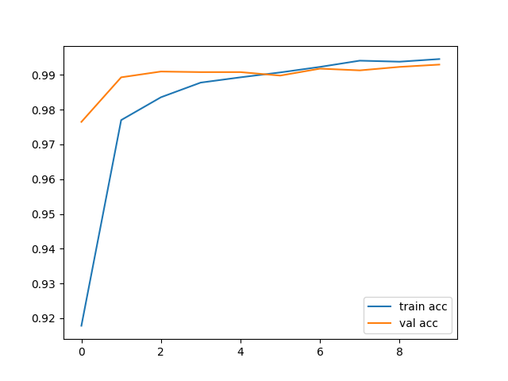
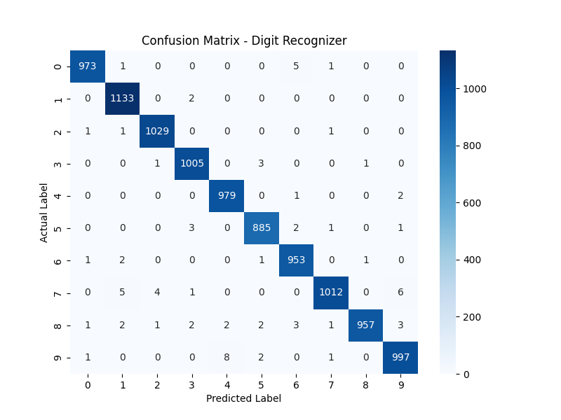

# Handwritten Digit Recognizer ✍️🤖

A Convolutional Neural Network (CNN) that recognizes handwritten digits (0-9), trained on the MNIST dataset and deployed as an interactive web app.

## 🎯 Problem Statement
Classify handwritten digit images into their correct numerical label (0-9) using deep learning.

## 📊 Dataset
- **MNIST Handwritten Digits Dataset**
- 60,000 training images, 10,000 test images
- 28x28 grayscale images, loaded via `tf.keras.datasets.mnist`

## 🧠 Model Architecture
- 3 Convolutional layers (with MaxPooling)
- Dense layer with Dropout for regularization
- Softmax output layer for 10-class classification

## ✅ Results
- **Test Accuracy: 99.23%**

### Training Accuracy Curve


### Confusion Matrix


## 🚀 Live Demo
Try it here: https://digit-recognizer-app-nqrbfvqmku7jsxobtrtasr.streamlit.app/

## 🛠️ Tech Stack
- TensorFlow / Keras (model building & training)
- Streamlit (web app interface)
- Pillow (image preprocessing)
- NumPy, Matplotlib, Seaborn (data handling & visualization)
- Streamlit Community Cloud (deployment)

## 💻 Run Locally
```bash
git clone https://github.com/Vedika130425/digit-recognizer-app.git
cd digit-recognizer-app
pip install -r requirements.txt
streamlit run app.py
```

## 📖 What I Learned
- Building and training CNNs for image classification
- Preprocessing image data for model input
- Deploying ML models as interactive web apps
- Debugging real-world dependency/Python-version issues during cloud deployment
